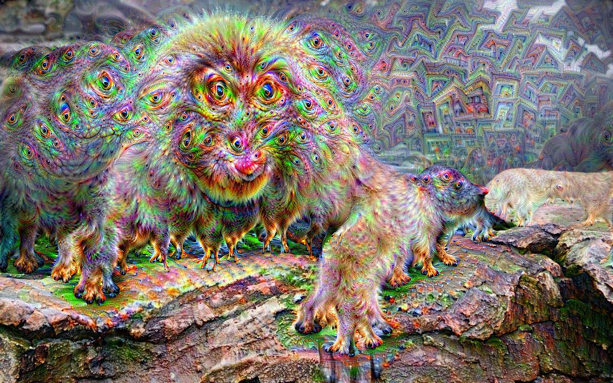
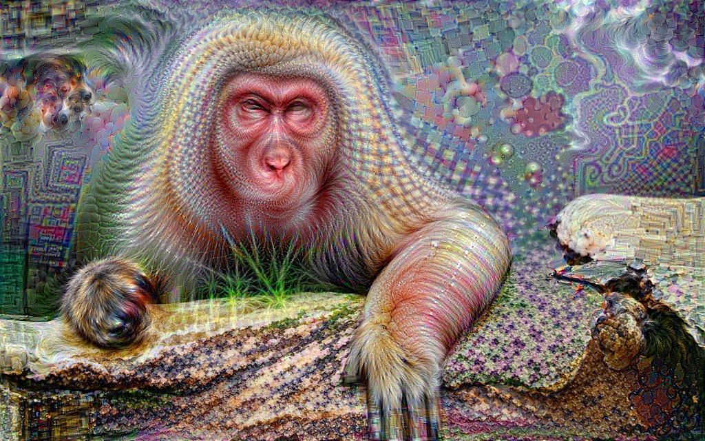
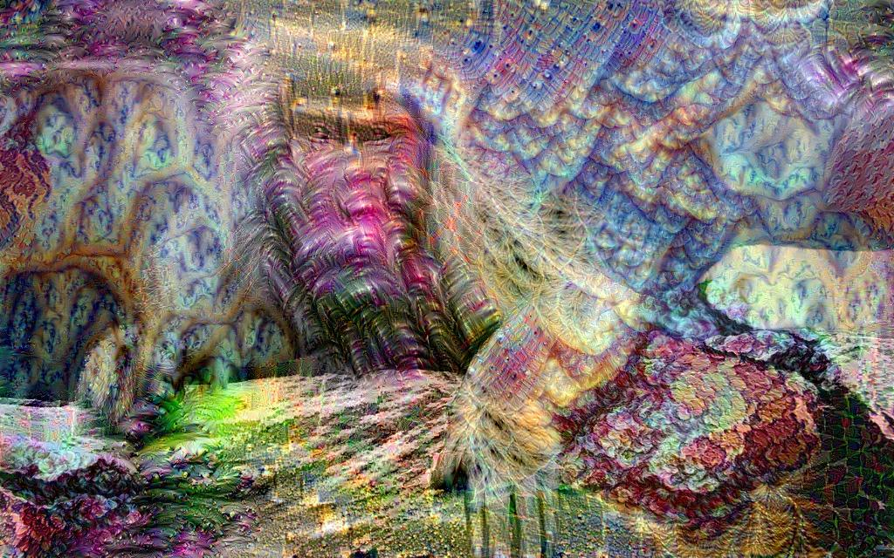

# Deep Dream with VGG16 and DenseNet121

## Project Overview
In this project, I delve into the fascinating world of Deep Dream, a computer vision technique that tweaks an image to amplify patterns and features identified by a neural network. My objective is to create a sequence of images that increasingly highlight the attributes of a monkey as detected by two distinct models: VGG16 and DenseNet121. The adventure culminates with an artistic twist, incorporating motifs from banana and cherry images to nudge the dream into fresh and visually captivating territories.

## Methodology
- **Initial Image**: I begin with a snapshot of a monkey, which serves as the foundation for the Deep Dream exploration.
- **Pre-Trained Models**: I utilize two esteemed convolutional neural network models—VGG16 and DenseNet121—both pre-trained on the vast ImageNet dataset. Their expertise in feature detection is harnessed to accentuate particular aspects within the monkey's image.
- **Feature Enhancement**: Through repeated application of the Deep Dream technique, I intensify the model-recognized features from the original image, crafting intricate, dreamy illustrations.
- **Guided Dream**: Taking a unique turn, I direct the course of the Deep Dream by integrating banana and cherry images. This inventive step alters the trajectory of feature enhancement, resulting in an artistic fusion of the initial monkey image with the selected fruit features.

## Results
The project vividly demonstrates the power of Deep Dream to magnify an image's aesthetic elements through the lens of various neural network architectures. The images produced are a rich mosaic of textures and patterns that merge the recognizable with the abstract.

## Tools and Technologies Used
- **Deep Learning Framework**: PyTorch
- **Pre-Trained Models**: VGG16 and DenseNet121, sourced from PyTorch's torchvision package
- **Image Processing**: Employed PIL for image modifications

## Output Visualizations

Below are some examples of the output images generated by the Deep Dream algorithm, using the VGG16 and DenseNet121 models:

### Deep Dream with VGG16

### Deep Dream with DenseNet121

### Guided Deep Dream - Banana

### Guided Deep Dream - Cherry

